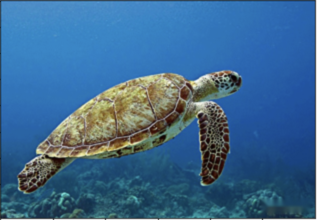
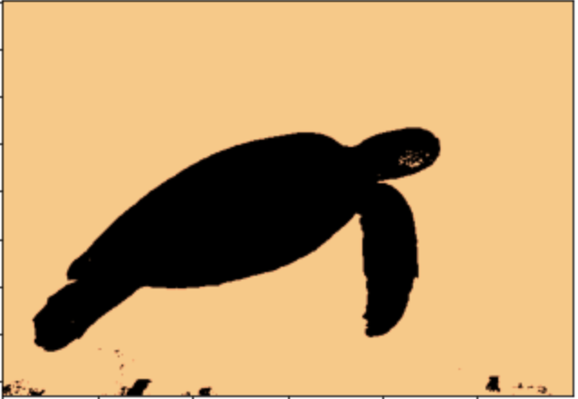

## Project Description
K-means clustering is popular in the field of data mining as a cluster analysis method. This project uses the K-means algorithm for image segmentation.

## Prepare the data
Prepare a color picture:

      

## Result
The result of K=2 is:

      

